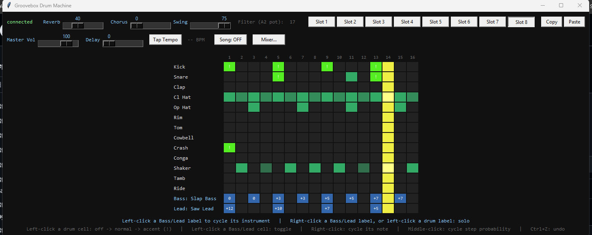
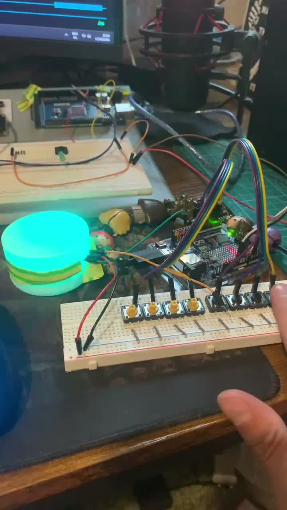
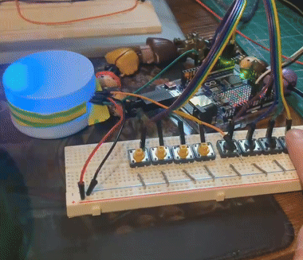

# GROOVEBOX

```
┌───┬───┬───┬───┬───┬───┬───┬───┬───┬───┬───┬───┬───┬───┬───┬───┐
│ █ │   │   │   │ █ │   │   │   │ █ │   │   │   │ █ │   │   │   │  kick
│   │   │ █ │   │   │   │   │   │   │   │ █ │   │   │   │   │   │  snare
│ █ │   │ █ │   │ █ │   │ █ │   │ █ │   │ █ │   │ █ │   │ █ │   │  hats
│ ░ │   │   │ ░ │   │ ░ │   │   │ ░ │   │   │ ░ │   │   │ ░ │   │  bass
└───┴───┴───┴───┴───┴───┴───┴───┴───┴───┴───┴───┴───┴───┴───┴───┘
```

An Arduino UNO R4 WiFi that gave up trying to make its own sound and
started bossing a real MIDI rig around instead. Buttons, a pot, an
LED matrix, and a NeoPixel ring on one side; a full 15-track
step-sequencer GUI with swing, accent, per-step probability, delay,
song-mode arrangement, and a mixer on the other -- talking to each
other over a few bytes of serial, sixteen times a bar.

The board doesn't know what a "kick" is. It just keeps time, reads
buttons, and lights things up. Every musical decision happens
PC-side, where a screen and a mouse can actually do the job six
tactile switches and a 12x8 grid of LEDs never could.

## What it looks like running



*Connected to the board, mid-pattern -- Slap Bass and Saw Lead on
their own MIDI channels, kick/snare accents lit up, hi-hats rolling,
swing dialed to 75.*

## The hardware



R4 on a breadboard, 8 pushbuttons wired for pattern/mute/fill/stop,
and the NeoPixel ring synced



## Architecture

```
groovebox.ino              firmware -- clock, buttons/pot, BLE, matrix + ring display
groovebox_drum_machine.py  entry point -- opens the serial link, launches the GUI
groovebox_app/
  patterns.py               track list + pattern data model (load/save JSON)
  midi_output.py             MIDI port + note playback (velocity, delay/echo)
  serial_link.py              board communication (auto-reconnect, wire protocol)
  gui.py                       the step-grid window, wires everything together
  effects.py                    reverb/chorus/filter-cutoff MIDI CC helpers
  history.py                     undo stack
  song_mode.py                    chains pattern slots into an arrangement
  mixer_window.py                  per-track volume/pan window
  render_song.py             renders your saved patterns to a standalone .mid file
  compose_song.py            composes brand-new patterns via the real editing
                              methods (not the saved data) -- see below
  tests/test_groovebox.py    headless test suite (drives the real GUI class)
groovebox_patterns.json    your 8 saved pattern slots
groovebox_settings.json    swing, master volume, delay, instrument choice, mixer levels
```

The board has **no idea** what a "kick" or "bass" is -- it just keeps
a clock and reports 5 mute-group bits. The PC owns everything musical.

## Running it

1. Flash the firmware:
   ```
   arduino-cli compile --fqbn arduino:renesas_uno:unor4wifi groovebox.ino
   arduino-cli upload -p COM9 --fqbn arduino:renesas_uno:unor4wifi groovebox.ino
   ```
   (Close the Python app first -- `arduino-cli upload`'s 1200-baud
   touch-reset needs exclusive access to the port.)

2. Install dependencies (once):
   ```
   pip install -r requirements.txt
   ```

3. Run the app:
   ```
   python groovebox_drum_machine.py COM9
   ```
   (Omit the port to auto-detect; it'll list available ports if it
   can't find one.)

MIDI plays through Windows' built-in "Microsoft GS Wavetable Synth" by
default -- no extra install needed. Swap `MIDI_PORT_NAME` in
`midi_output.py` to route into a real DAW instead.

## Controls

**Physical (board):**
| Control | Function |
|---|---|
| A1 pot | BPM (80-160) |
| A2 pot | live filter cutoff (optional, unconnected reads a steady value) |
| D2 | cycle pattern slot (1 -> 2 -> ... -> 8 -> 1...) |
| D3/D4/D6/D7/D8 | mute toggle: kick / snare+clap / hats+perc / bass / lead |
| D9 | Fill (PC decides what actually layers in) |
| D5 | Start/Stop |
| BLE `R4-Groovebox` | phone can set pattern slot, BPM, mutes, trigger a fill |

**GUI (mouse):**
| Action | Effect |
|---|---|
| Left-click a drum cell | off -> normal -> accent (!) |
| Left-click a Bass/Lead cell | toggle on/off |
| Right-click a cell | cycle its note (Bass/Lead only) |
| Middle-click a cell | cycle step probability (100/75/50/25%) |
| Left-click a Bass/Lead label | cycle its instrument |
| Right-click a Bass/Lead label, left-click a drum label | solo that group |
| Ctrl+Z | undo |
| Copy / Paste buttons | copy a pattern slot to another |
| Tap Tempo | click a few times, sends the computed BPM to the board |
| Song: ON/OFF | chains pattern slots into an arrangement (see `song_mode.py`) |
| Mixer... | per-track volume/pan window |

**Display (matrix + ring):** row 7 of the LED matrix is a steady
mute/unmute dot per group; rows 0-5 flash briefly on real hits; a
letter/number glyph flashes on every button/BLE action. The NeoPixel
ring mirrors the same hits with a 5-color arc (kick=red, snare=yellow,
hat=cyan, bass=purple, lead=green) that pulses and decays.

## Utility scripts

- **`render_song.py`** -- arranges your 8 saved pattern slots into a
  produced song structure (intro/build/drop/breakdown/outro, with
  group muting, volume ramps, and delay per section) and renders it to
  `groovebox_song.mid`. Run: `python groovebox_app/render_song.py`
- **`compose_song.py`** -- composes brand-new patterns from scratch by
  driving `DrumMachine`'s real editing methods (`toggle_cell`,
  `cycle_note`, `cycle_prob`, `change_instrument`) against an empty
  grid, then renders them to `groovebox_generated_song.mid`. Also has
  `overwrite_real_slots()`, which does the same thing but writes
  straight into your real saved slots (used to populate the current 8
  patterns -- see git history for the originals).

## Testing

```
cd groovebox_app
python -m pytest tests/test_groovebox.py -v
```

18 tests, all headless (a hidden Tk root, a fake serial link, a fake
MIDI port) -- they drive the actual `DrumMachine` class and
`patterns.py`/`history.py`/`song_mode.py` directly, not
reimplementations of the logic.

## Known gotchas

- **COM port contention:** `arduino-cli upload` and the Python app
  can't hold the port at the same time. Standard workflow: stop the
  app, flash, restart the app.
- **Windows unplug/replug:** unplugging the board kills the Python
  side's serial handle even after replugging on the same port --
  `serial_link.py` auto-reconnects, but give it a second.
- **UI automation and instrument drift:** driving the GUI with
  `pyautogui`/window-focus tools (for testing) can leave the OS cursor
  resting over a clickable label; a later window redraw/focus change
  can then deliver a phantom click there. `change_instrument` on the
  Bass/Lead row labels is one of the few clicks that silently persists
  to disk, so this is worth knowing if you ever automate this GUI.
  Confirmed via `event.send_event`/stack-trace logging that it's a
  real (if spurious) `<Button-1>` dispatch, not a data bug -- moving
  the cursor away from the window before any automated relaunch avoids
  it entirely.
